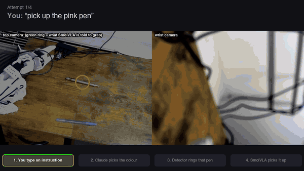
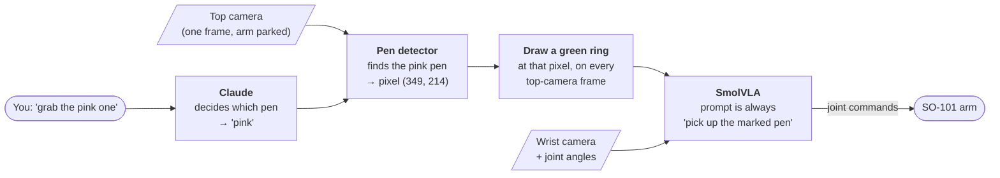
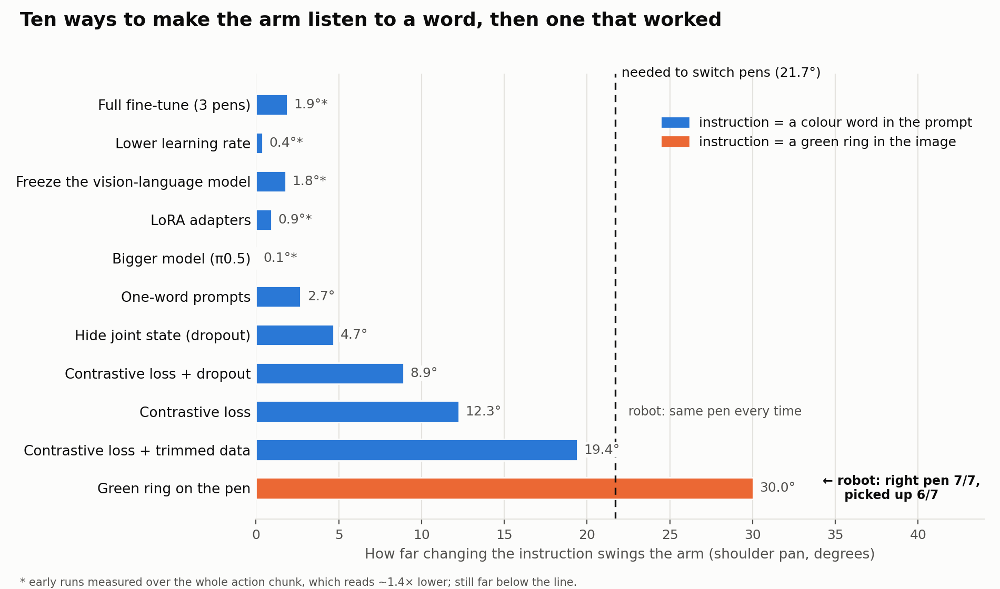

# Pick the pen I ask for

**An SO-101 robot arm that picks up whichever pen you name: Claude decides, a green ring points, and SmolVLA does the picking.**



*Real robot, real time, unedited. Full video with every attempt from the session, including the one that didn't lift the pen: [`media/demo_marker.mp4`](./media/demo_marker.mp4)*

After ten attempts to make a robot foundation model follow a one-word instruction, all of which
failed, the fix was to **stop giving it the instruction as a word.** Over 7 robot attempts the arm went to
the right pen 7/7 times and picked it up 6/7 times, using the same 60 demonstrations, the same model and the
same training recipe as the attempts that failed.

---

## How it works



Each step goes to the part that's best at it:

| Step | What does it | Good at | Code |
|---|---|---|---|
| **Decide** which pen | Claude (Haiku) | understanding language, including "the rose-gold one" or "something to write in blue" | [`tools/marker_aim.py`](./tools/marker_aim.py) |
| **Locate** it | colour + shape detector | finding a pen in an image in milliseconds | [`tools/marker_overlay.py`](./tools/marker_overlay.py) |
| **Point** at it | a green ring drawn into the camera image | being impossible to miss | [`tools/marker_shim.py`](./tools/marker_shim.py) |
| **Do** the pick | SmolVLA (450M-param vision-language-action model) | smooth, human-like reaching and grasping, learned from 60 demos | [`tools/marker_rollout.sh`](./tools/marker_rollout.sh) |

SmolVLA never sees a word of your instruction. Its prompt is the same every time. The only thing
that changes is where the ring is.

**No new data was recorded for this.** The 60 existing demonstrations already said which pen was
picked, so [`tools/mark_dataset.py`](./tools/mark_dataset.py) drew the ring onto every frame
automatically. It finds both pens in each episode's first frame, rings the right one and checks
the result on a contact sheet.

---

## The story: ten failures and the lesson they taught

### The problem: the arm ignores the word

The goal was simple: two identical pens, one blue and one pink, and the arm picks the one you
name. SmolVLA is built for exactly this. It takes camera images *plus a text instruction*.

It learned to pick up a pen beautifully. It just always picked **the same** pen, whatever you
said. In the jargon, the policy "mode-collapsed".

**Why:** behaviour cloning trains the model to copy the demonstrated motion. Nothing in that
objective rewards using the instruction. When the two tasks share the same scene and differ by
a single word, the cheapest way to lower the loss is to ignore the word and learn one average
motion. Gradient descent takes the cheap route.

### How we measured it

Watching the robot is slow, so we built an offline probe
([`tools/directional_check.py`](./tools/directional_check.py)). It takes a real camera frame,
asks the model what to do with *"blue"*, then with *"pink"*, and measures how far the base joint
(`shoulder_pan`) moves between the two answers. The pens sit **43.4°** apart, so to switch pens
the instruction has to swing the arm past the midpoint: **21.7°**.



### What we tried, and why it didn't work

Each attempt tested one specific idea about *why* the word was being ignored:

| # | What we tried | The idea behind it | Result | What it taught us |
|---|---|---|---|---|
| 1 | Full fine-tune on three pens | the baseline | 1.9° | Three pens were too close together, so one motion was "close enough" for all three. We moved to two pens, far apart. |
| 2 | Lower learning rate | fine-tuning is erasing the model's language skills | 0.4° | No. It got *worse* with training. |
| 3 | Freeze the vision-language model | same idea: stop it forgetting | 1.8° | No. Freezing stops forgetting, but it doesn't make the model *use* the words. |
| 4 | LoRA adapters | too many trainable parameters for 60 demos | 0.9° | No. That closed the whole hyperparameter branch. |
| 5 | Bigger model (π0.5) | SmolVLA is too small | 0.05° | No. π0.5 ignores the prompt on this robot even *before* training. |
| 6 | One-word prompts (`blue` instead of `Pick up the blue pen`) | the colour word is drowned out by the other words | 2.7° | Partly. The first change that *grew* with training. The signal was the problem, not the model. |
| 7 | Hide the joint angles half the time | the model uses its own arm position as a shortcut | 4.7° | Partly, then it plateaued. |
| 8 | **Contrastive loss** | nothing in the loss rewards using the instruction, so add a term that does | 12.3° | **The breakthrough**: 4–5× better, and always in the right direction. |
| 9 | Contrastive + hidden joints | stack the two partial wins | 8.9° | They didn't stack. |
| 10 | Contrastive + trimmed data | 24% of frames were the arm sitting still, teaching "the word doesn't matter" | 19.4° | The best yet, and still just under the line. |

The contrastive loss ([`tools/contrastive_language_loss.py`](./tools/contrastive_language_loss.py))
runs every training example a second time with the *wrong* instruction and penalises the model
if it still predicts the same motion.

### The lesson that cost a robot session

Attempt 8 looked like the answer. Offline it moved toward the named pen in **16 out of 16**
checks, so we put it on the robot.

**It went to the same pen every time.**

The probe wasn't wrong; we had read it wrong. 12.3° is the right *direction*, but only 28% of the
*distance* needed to change pens. We had been ranking attempts against each other ("better than
last time") instead of against the only number that matters: **does it cross 21.7°?** By that
standard, no attempt had ever come close. From then on, a checkpoint had to clear the absolute
bar before it got robot time.

### The fix: change how the instruction arrives, not the model

Every attempt above asked one question: *how do we make the model listen to the word?* The
answer that worked was to stop asking it to.

- A **colour word** has to travel through the language side of the model and somehow change
  where the arm goes. That's a long, weak path, and with only 60 demos it never got strong enough.
- A **green ring** sits in the camera image, in the same place as the pen the arm has to reach.
  Vision models are already very good at "go to the thing that stands out". The instruction and
  the target are now in the same picture.

| | Best colour-word model | Green-ring model |
|---|---|---|
| Data | 60 demos | **the same** 60 demos, rings drawn on |
| Model and training | SmolVLA, frozen VLM, 10k steps | **the same** (minus the contrastive loss, which isn't needed) |
| Offline: arm swing when the instruction changes | 19.4° | **30.0°** (clears the 21.7° bar) |
| Offline: moves toward the named pen | 13/16 | **48/48** |
| Robot: right pen | — (its predecessor: same pen every time) | **7/7** |
| Robot: picked it up | — | **6/7** |

It was already this good after 5,000 training steps, half the run.

---

## What we learned

1. **Measure against the bar that matters, not against your last attempt.** "Better than before"
   hid the fact that nothing was working.
2. **When ten fixes to the model fail, change the problem instead.** The breakthroughs came from
   changing what the model was given and asked for (shorter prompts, a new loss term, trimmed
   data, and finally a ring), never from changing the model itself.
3. **Give each job to the part that's good at it.** Language understanding goes to the language
   model (Claude). Precise, smooth motion goes to the robot policy (SmolVLA). A simple, unambiguous
   signal (the ring) connects them.
4. **Build the cheap offline check first.** Every result above was measured on a laptop in
   minutes. The robot only got checkpoints that had already passed.
5. **Check that the picture can't answer the question by itself** (found afterwards, in
   [`vjepa/FINDINGS.md`](./vjepa/FINDINGS.md)). `pick_pen_v2` was recorded in four blocks
   (blue+left, pink+left, blue+right, pink+right). The pen that *wasn't* asked for never got
   touched, so it sat on exactly the same pixels for a whole block. From frames before the arm
   moves, even raw pixels predict "blue" vs "pink" with 100% accuracy. So in training the policy
   never needed the word, which plausibly explains why language stalled at 19.4° (not proven).
   Next time: shuffle colour and side per episode, and re-place **both** pens at every reset.

## Honest limits

- **7 robot attempts so far** (right pen 7/7, lifted 6/7). That's a strong start, not a reliable
  success rate. More trials, with the pens moved around, are next. The one miss went to the right
  pen and closed on it, but didn't lift it.
- **The pens were in the same two spots as in training.** We don't yet know how well it handles a
  pen somewhere new.
- **The camera must be back where it was during recording.** Across all 60 demos it never moved,
  so this model has seen exactly one view. [`tools/camera_align.py`](./tools/camera_align.py)
  helps you line it back up. Offline, choosing the right pen survived a 5° camera tilt.
- **The ring is placed once, at the start.** If a grasp fails and knocks the pen, it won't follow.
  Claude would need to look again and redraw it.

---

## Run it yourself

All commands run from the repo root on a Mac with the SO-101 and both cameras plugged in.

```bash
# 1. line the top camera up with the training view (live window; aim for GOOD)
uv run --no-sync python my_contributions/tools/camera_align.py

# 2. run attempts: type an instruction, check the ring preview, press Enter to run the arm,
#    then answer two y/n questions about how it went
./my_contributions/tools/marker_rollout.sh "pick up the pink pen" 3

# 3. turn the recorded attempts into a demo video (instructions and outcomes were logged in step 2)
uv run --no-sync python my_contributions/tools/make_demo_video.py bklassen3434/rollout_marker_<stamp>
```

To rebuild from scratch: mark the dataset
([`tools/mark_dataset.py`](./tools/mark_dataset.py)), train on Modal
([`modal/modal_train_pick_pen.py`](./modal/modal_train_pick_pen.py) with
`--dataset bklassen3434/pick_pen_v2_marked --freeze-vlm --steps 10000`), then check the result
offline before using the robot ([`tools/marker_probe.py`](./tools/marker_probe.py)).

**On the Hugging Face Hub:** dataset
[`bklassen3434/pick_pen_v2_marked`](https://huggingface.co/datasets/bklassen3434/pick_pen_v2_marked) ·
model [`bklassen3434/smolvla_pick_pen_v2_marked`](https://huggingface.co/bklassen3434/smolvla_pick_pen_v2_marked)

The full lab notebook, with every dataset, every checkpoint and every number, is
[`PROJECT_LOG.md`](./PROJECT_LOG.md).
